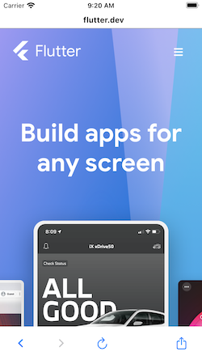
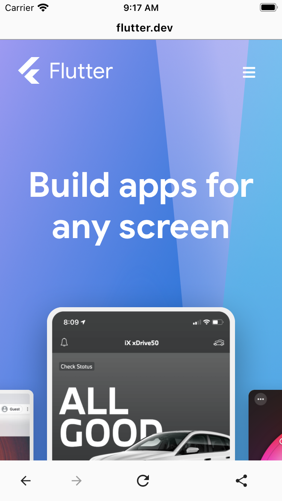

[](https://pub.dartlang.org/packages/web_browser)
[](https://github.com/dint-dev/web_browser/actions?query=workflow%3A%22Dart+CI%22)

# Overview
The package gives you [Browser](https://pub.dev/documentation/web_browser/latest/web_browser/Browser-class.html),
a Flutter widget for displaying web pages.

The package is built on top of [webview_flutter](https://pub.dev/packages/webview_flutter) and it
adds navigation widgets that:
  * Display the domain.
  * Allow user to tap "back", "forward", "refresh", or share the URL using a native dialog of each
    platform.
  * Display website loading error messages in a visually pleasant and easy-to-understand way.

_Browser_ has been tested in Android, iOS, and browsers. By adding relevant "webview_flutter"
plugin dependencies to your "pubspec.yaml", you can use this package in Windows, Mac OS X, and
Linux too.

Licensed under the [Apache License 2.0](LICENSE).

## Links
* [Github project](https://github.com/dint-dev/web_browser)
* [Issue tracker](https://github.com/dint-dev/web_browser/issues)
* [API Reference](https://pub.dev/documentation/web_browser/latest/index.html)

# Setting up
## 1.Setup
In _pubspec.yaml_:
```yaml
dependencies:
  web_browser: ^0.7.4
```

## 2.Display web browser
```dart
import 'package:flutter/material.dart';
import 'package:web_browser/web_browser.dart';

void main() {
  runApp(const MaterialApp(
    home: Scaffold(
      body: SafeArea(
        child: Browser(
          initialUriString: 'https://flutter.dev/',
        ),
      ),
    ),
  ));
}
```

# Manual
## Default designs
The package contains two designs, Cupertino ([web_browser.cupertino](https://pub.dev/documentation/web_browser/latest/web_browser.cupertino/web_browser.cupertino-library.html))
and Material ([web_browser.material](https://pub.dev/documentation/web_browser/latest/web_browser.cupertino/web_browser.material-library.html)).
By default, the package chooses a Cupertino or Material design based on whether the app is _CupertinoApp_ or _MaterialApp_.
You can override the defaults by using relevant parameters of
[Browser()](https://pub.dev/documentation/web_browser/latest/web_browser/Browser/Browser.html)
constructor.

The Cupertino and Material navigation bars look like this:





## Localization
Use [BrowserLocalizations](https://pub.dev/documentation/web_browser/latest/web_browser/BrowserLocalizations-class.html)
to localize the widgets.

```dart
void main() {
  runApp(MaterialApp(
    localizations: [
      ...browserLocalizationsList,
      // ...
    ],
    // ...
  ));
}

final browserLocalizationsList = [
  // Spanish localization
  BrowserLocalizations.forLocale(
    locale: Locale('es'),
    load: (locale) async => BrowserLocalizations(
      couldNotReach: 'No se pudo acceder al sitio web.',
      // ...
    ),
  ),
];
```

## Setting various parameters
You can give various parameters to [Browser](https://pub.dev/documentation/web_browser/latest/web_browser/Browser-class.html):
```dart
import 'package:flutter/material.dart';
import 'package:web_browser/web_browser.dart';

void main() {
  runApp(const MaterialApp(
    home: Scaffold(
      body: SafeArea(
        child: Browser(
          initialUriString: 'https://flutter.dev/',
          controller: BrowserController(
            // "User-Agent" HTTP header.
            userAgent: 'Your user agent',
            
            // Can user zoom into the content? Default is true.
            isZoomingEnabled: false,
          )
        ),
      ),
    ),
  ));
}
```

## Cache clearing
For end-users privacy, it is good to clear:
  * Cookies
  * Caches
  * Local storage

You can enable this by setting:
```dart
import 'package:web_browser/web_browser.dart';

void main() {
  // Clear when the app is started
  BrowserController.resetGlobalStateAtStart = true;
  
  // Clear every now and then.
  BrowserController.globalStateExpiration = const Duration(days: 1);
  
  // ...
}
```

## Accessing WebViewController
To access [WebViewController](https://pub.dev/documentation/webview_flutter/latest/webview_flutter/WebViewController-class.html)
by using [browserController.webViewController](https://pub.dev/documentation/web_browser/latest/web_browser/BrowserController/webViewController.html).